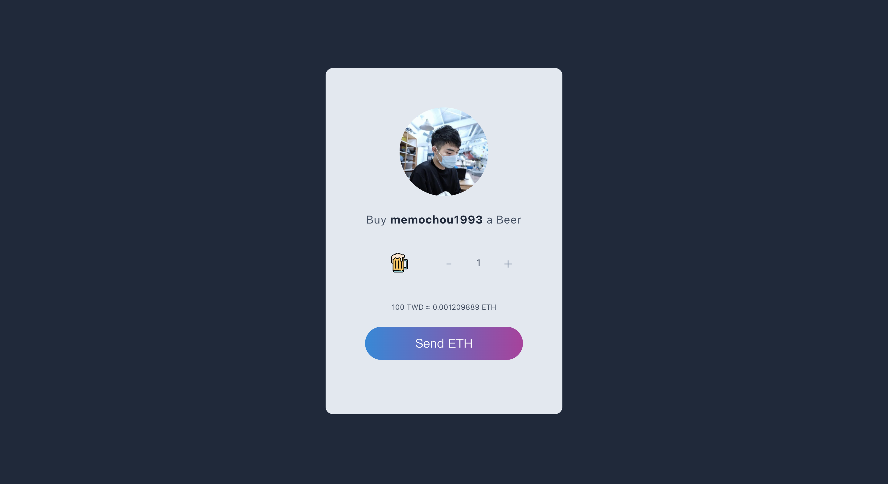

# eth-donation

<a href="https://memochou1993.github.io/eth-donation/" target="_blank" rel="noopener noreferrer"></a>

## Demo

<a href="https://memochou1993.github.io/eth-donation/" target="_blank" rel="noopener noreferrer"></a>

## Development

Copy `.env.local.example` to `.env.local`.

```ENV
REACT_APP_COINBASE_API_URL=https://api.coinbase.com/v2
REACT_APP_ETHERSCAN_URL=https://etherscan.io
REACT_APP_GITHUB_USERNAME=<your-github-username>
REACT_APP_WALLET_ADDRESS=<your-wallet-address>
```

Install dependencies.

```BASH
npm ci
```

Start app.

```BASH
npm run start
```

## Deploy

Update `package.json`.

```JSON
{
  "homepage": "https://<your-github-username>.github.io/eth-donation/"
}
```

Build app.

```BASH
npm run build
```

Deploy app.

```BASH
npm run deploy
```

## Contributors

<a href="https://github.com/memochou1993/eth-donation/graphs/contributors">
  
</a>
